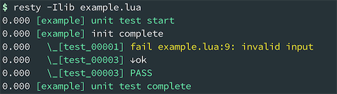
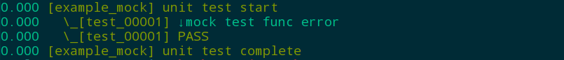

# Name
lua-resty-test is Ngx_lua test frame based on Openresty


# Description
This Lua library is a test frame for test your ngx_lua source or other server(tcp or udp):

http://wiki.nginx.org/HttpLuaModule

# Synopsis


```lua
-- test.lua
local iresty_test    = require "resty.iresty_test"
local tb = iresty_test.new({unit_name="example"})

function tb:init(  )
    self:log("init complete")
end

function tb:test_00001(  )
    error("invalid input")
end

function tb:atest_00002()
    self:log("never be called")
end

function tb:test_00003(  )
    self:log("ok")
end

-- units test
tb:run()
```

Run test case:



# Mock Example
lua-resty-test provides a mock_run method to users testing.We always need to test whether the interface can be properly handled when the function returns an error. And mock_run method can help us solve this problem.

example:
```lua
local iresty_test    = require "resty.iresty_test"
local tb = iresty_test.new({unit_name="example_mock"})

local M = {}
function M.test()
    return "hello world"
end


function tb:test_00001()
    local function mock_test()
        return "mock test func error"
    end

    local mock_rules = {
        { M, "test", mock_test}
    }

    local function mock_test_run()
        self:log(M.test())
    end

    self:mock_run(mock_rules, mock_test_run)
end

-- units test
tb:run()

```

Run mock test case:
```shell
resty -Ilib example_mock.lua
```



# Author
Yuansheng Wang "membphis" (王院生) membphis@gmail.com, 360 Inc.

# Copyright and License
This module is licensed under the BSD license.

Copyright (C) 2016-2019, by "membphis" (王院生) membphis@gmail.com.

All rights reserved.

Redistribution and use in source and binary forms, with or without modification, are permitted provided that the following conditions are met:

Redistributions of source code must retain the above copyright notice, this list of conditions and the following disclaimer.

Redistributions in binary form must reproduce the above copyright notice, this list of conditions and the following disclaimer in the documentation and/or other materials provided with the distribution.

THIS SOFTWARE IS PROVIDED BY THE COPYRIGHT HOLDERS AND CONTRIBUTORS "AS IS" AND ANY EXPRESS OR IMPLIED WARRANTIES, INCLUDING, BUT NOT LIMITED TO, THE IMPLIED WARRANTIES OF MERCHANTABILITY AND FITNESS FOR A PARTICULAR PURPOSE ARE DISCLAIMED. IN NO EVENT SHALL THE COPYRIGHT HOLDER OR CONTRIBUTORS BE LIABLE FOR ANY DIRECT, INDIRECT, INCIDENTAL, SPECIAL, EXEMPLARY, OR CONSEQUENTIAL DAMAGES (INCLUDING, BUT NOT LIMITED TO, PROCUREMENT OF SUBSTITUTE GOODS OR SERVICES; LOSS OF USE, DATA, OR PROFITS; OR BUSINESS INTERRUPTION) HOWEVER CAUSED AND ON ANY THEORY OF LIABILITY, WHETHER IN CONTRACT, STRICT LIABILITY, OR TORT (INCLUDING NEGLIGENCE OR OTHERWISE) ARISING IN ANY WAY OUT OF THE USE OF THIS SOFTWARE, EVEN IF ADVISED OF THE POSSIBILITY OF SUCH DAMAGE.

# See Also

* the ngx_lua module: http://wiki.nginx.org/HttpLuaModule
